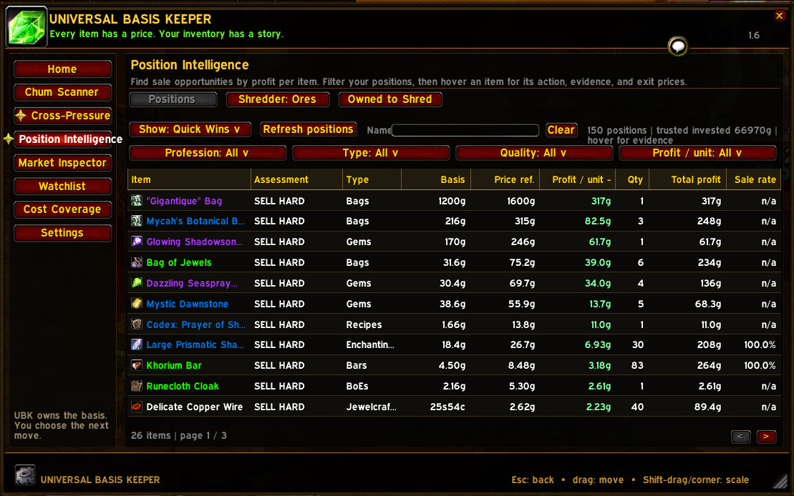
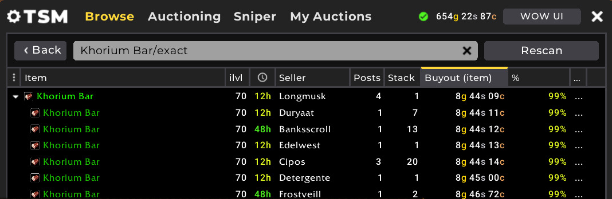
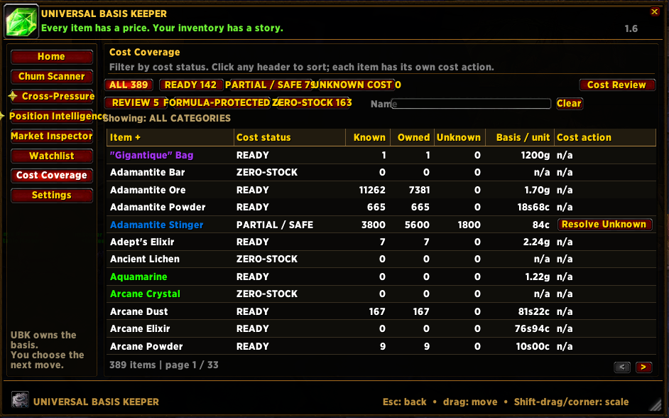
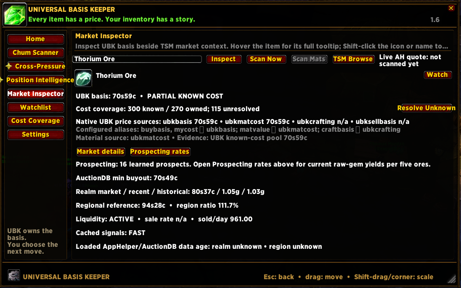
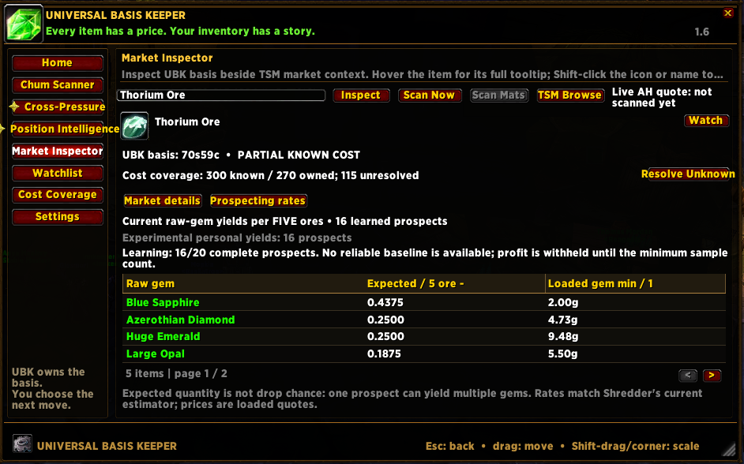

# UBK - Universal Basis Keeper

**1.6.1a performance update:** reduces repeated purchase-history and tooltip work that could interrupt play. Close WoW and run the updated installer to update both UBK and its TSM integration.

Version 1.6.1a • TBC Anniversary

**Every item has a price. Your inventory has a story.**

Universal Basis Keeper is a companion to TradeSkillMaster for **WoW TBC Anniversary realms**. It connects purchase evidence, material costs, and practical review tools so you can see what your stock cost before deciding what to make or sell.

A market quote answers what someone is asking today. Your basis answers what you have invested. UBK keeps both on the desk. TSM handles your crafting queue and auctions; UBK gives those decisions a cost record you can inspect.

## What you need

**The TradeSkillMaster addon is required. UBK does not work without it.** [Get the TBC Anniversary TSM addon from CurseForge](https://www.curseforge.com/wow/addons/tradeskill-master/files/all?page=1&pageSize=20&gameVersionTypeId=73246&showAlphaFiles=hide).

TSM's Desktop Application is **optional and recommended**. UBK can track costs without it, but refreshed market data makes the comparisons more useful. Missing or stale quotes limit what any auctioning tool can tell you. [TSM's official Desktop Application setup guide](https://support.tradeskillmaster.com/tsm-desktop-application/how-do-i-set-up-the-tsm-desktop-application?from_search=238849512) explains that connection.

## Install and take a first look

Download the [installer](installer.exe), [complete source ZIP](source.zip), or [full download folder](https://github.com/Jcplugs/UBK-Universal-Basis-Keeper/releases/download/v1.6.1a/UBK-1.6.1a.zip). The standalone addon is in [Interface/AddOns/UniversalBasisKeeper](Interface/AddOns/UniversalBasisKeeper).

1. Close WoW and run `installer.exe` for a new installation or an update.
2. Choose the `_anniversary_` client folder containing `WowClassic.exe` and `Interface`. The installer checks for TSM, backs up supported old code, and preserves your local history and settings.
3. Open WoW, enable UBK, and type `/ubk` or click its minimap button.
4. Begin with **Cost Coverage**. Check a familiar material, open your profession, and inspect one recipe. Settings > **TSM Sources & Integration** explains the available cost sources.

The EXE installs the complete addon and its TSM integration for new and existing users. You can also copy the supplied `Interface/AddOns/UniversalBasisKeeper` folder into your client. If the required integration is missing, UBK warns after login; close WoW and run `installer.exe` to complete it. The `source.zip` archive contains the complete build source.

Installing UBK does not rewrite all your personal TSM operations. The [User Guide](USER_GUIDE.md) explains how to connect them.

## New in 1.6.1a

UBK reuses unchanged purchase history and reads settled tooltip/status data without rebuilding the tracked-material list. When TSM records a transaction change, the purchase export is refreshed for the next accounting pass. This reduces repeated work during ordinary movement and item interactions while keeping new purchases available for settlement.

The existing installer-managed TSM integration remains required. Native cost sources, crafting, Sell Above Basis, and group-return recovery keep their existing workflows. TSM's mailing behavior is unchanged by this public release.

When upgrading from 1.6, run the new installer even if UBK already loads: this update includes its TSM integration. Your saved basis history, settings, and operations remain in place. The earlier 1.6 prospecting hotfix is included.

## Position Intelligence: put your holdings to work

Position Intelligence brings your holdings, recorded cost, and loaded market prices together so you can decide where to focus. See what could sell above basis, what ties up your gold, and which positions need better cost evidence before you act.

The table puts **Basis**, **Price ref.**, **Profit / unit**, **Qty**, **Total profit**, and **Sale rate** beside each item's assessment. Start with **Quick Wins**, or switch to **All**, **Sell**, **Add**, **Risk**, or **Cost review**. Search by name, filter by profession, item type, quality, or per-item profit, and click column headers to sort.

Hover a holding for the reasoning behind its assessment: cost coverage, invested gold, share of fully costed positions, liquidity, supporting signals, and specific buy and sell price levels. When the estimate supports it, UBK also shows how many units would recover the position's current basis and how many would remain. Left-click opens **Market Inspector**; right-click adds the item to your **Watchlist**.

**Quick Wins** requires fully covered, trusted costs, an estimated net return of at least 15%, and a market not marked thin. Profit estimates subtract the 5% AH cut and reserve one failed 24-hour deposit when vendor value is available. The default ranking is profit per item, with quantity and total profit shown separately. Incomplete costs are marked **COST NEEDED** and their profit is withheld.

These assessments use currently loaded TSM data. Open Market Inspector and scan at the AH to check listings before acting; UBK leaves the buying and selling decisions with you.

### Follow an actual Khorium Bar examination

These captures show a player reviewing **83 Khorium Bars at 4.50g basis**, opening the assessment, and comparing loaded references of **8.48–8.49g** with a completed AH scan around **8.44g** and the actual TSM listings. [Follow the Khorium walkthrough](docs/KHORIUM-WALKTHROUGH.md) to see the recorded cost, estimated profit, live quote, and listings. Prices vary slightly between the captures taken that morning.

## A cost is different from a sale price

Consider a hypothetical evening: you buy twenty Living Rubies at **55g each**, but your configured TSM material formula still values them at **30g**. A cut consuming one ruby appears to sell for **45g**.

After the 5% faction-AH fee, each sale returns 42g75s. Against the configured cost, it appears to earn 12g75s. Against your purchase, it loses 12g25s. Selling all twenty leaves you **245g down**, before any lost deposits.

With the purchase recorded and UBK material pricing applied, the recipe shows the 55g cost. A realistic sale estimate and positive TSM Crafting minimum-profit rule can then exclude it from restocking. You can inspect another cut, compare selling the ruby raw, or wait. UBK does not prevent deliberate manual crafting or make an unprofitable market profitable.

This example concerns a configured cost input, not an unavoidable flaw in TSM. TSM already supports custom prices. UBK's contribution is maintaining acquisition evidence and making the connection to those prices visible.

## A look inside UBK

These are real in-game captures from a player's existing UBK 1.6 session on
7 September 2026. Prices and quantities describe that moment; they are not
sample records installed with the addon.

**Cost Coverage:** known, owned and unresolved quantities beside each item's basis
and cost action. Filters, name search and sortable columns narrow the list.

**Market Inspector:** Thorium Ore with recorded basis, partial cost coverage,
loaded AuctionDB comparisons, and links to scan, resolve or inspect prospecting
rates. This capture shows loaded market data; its live AH scan has not run.

**Prospecting rates:** the local sample count, expected gems per five ore,
and loaded gem quotes. This Thorium sample is still learning, so the panel
withholds a profit estimate until its minimum sample is met.

## Where to begin

| Area | What you can do |
| --- | --- |
| **Cost Coverage** | Search materials by name, inspect missing costs, resolve unknown stock, and adopt basis pricing while retaining the previous material formula. Grey vendor trash stays out of the review queue. |
| **Market Inspector** | Inspect one item, use **Scan Now** for a live AH quote, open its **TSM Browse** search, or **Scan Mats** to compare recipe costs with current shopping quotes. Vials and known vendor supplies stay off the AH shopping list. |
| **Sell Above Basis** | Select eligible bag items, set basis boundaries and posting percentages, then temporarily give them a dedicated TSM Auctioning group. Return them to their recorded original groups afterward. Stack size stays one. |
| **Shredder: Ores** | Rank expected raw-gem profit per five ore, inspect yield sources, and open TSM Destroying. Complete personal prospects strengthen the local estimates. Recorded ore expenses settle into actual outputs after reload. |
| **Position Intelligence** | Review sale opportunities, exposure, and cost gaps across your holdings. Compare net profit per item and for the position, then inspect the assessment, evidence, liquidity, and buy/sell levels. |
| **Watchlist** | Keep dates, starting values, latest loaded minimum buyouts, and sale-rate context together in sortable columns. |
| **Chum and Cross-Pressure** | Investigate price signals and keep a playbook of related materials and the opportunities you are following. |
| **Sources & Integration** | See UBK's native TSM sources, existing custom aliases, availability, and worked gold examples. Keep this window open alongside the main interface. |

**Craft Next** remains below the active TSM window while a profession is open. It requires your click. The minimap button opens Home on left-click and Sell Above Basis on right-click.

## A small example to try

Four known cuts that each consume one gem with a 5g material cost all have a 5g recipe basis. Their demand and expected selling prices can differ. UBK's `ubkcrafting` source keeps that recipe-cost anchor consistent; a crafted sale estimate remains a separate input.

Sell Above Basis defaults to **110% / 175% / 500%** of its confirmed session basis, with up to **10 singles per item type**. You can change those percentages and the cap before confirming. At 5g basis, the defaults are 5g50s / 8g75s / 25g. The minimum is a posting rule. Buyers may not pay it; include fees when choosing your percentages.

Pending prospecting outputs stay out of Sell Above Basis until their session costs settle. If a gem type is pending, existing copies of that type are also withheld from that workflow. Read the [prospecting workflow](USER_GUIDE.md#prospecting-from-ore-to-settled-cost) before your first batch.

## Accounting that waits until you finish

While the AH, mailbox, trade, vendor, or loot window is open, UBK retains acquisition evidence and leaves automatic basis updates queued. After transaction windows close, it reconciles the batch. Cost Coverage shows when accounting is pending. This keeps repeated history checks out of collecting mail and browsing auctions; it does not change the game's auction-query limits.

## Your records, on your PC

The addon installs no player's account, inventory, purchases, watchlist, or personal yield observations. The documentation screenshots show an existing player session. Each account uses its own evidence. WoW saves UBK history and settings through its normal SavedVariables; TSM saves the temporary-group return journal beside its group data. The addon is an independent community project, not an official TSM product.

Read the [User Guide](USER_GUIDE.md), [inside cover](docs/INSIDE-COVER.md), [basis explanation](docs/UNDER-THE-HOOD-BASIS.md), and [changes since 1.4](UBK_RELEASE_NOTES.txt). The [source build instructions](BUILD.txt) describe `source.zip`. Automated checks and remaining in-game checks are documented in [VERIFICATION.txt](VERIFICATION.txt) and [STRESS-TESTS.md](STRESS-TESTS.md).
