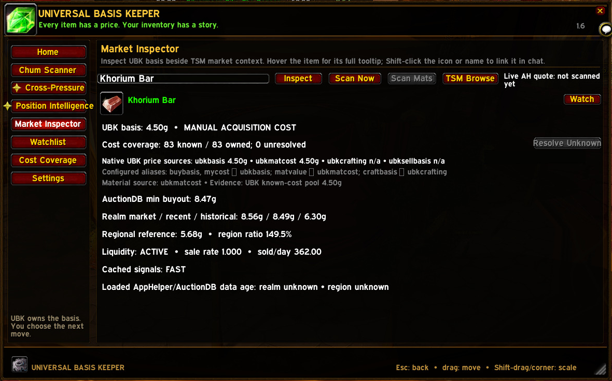

# From a holding to the AH: examining Khorium Bars

An actual UBK 1.6 session on 7 September 2026, shown through cropped views of the relevant UBK and TSM panels. The player starts with Position Intelligence, checks the recorded cost and loaded market context, scans the live AH, and opens the listings in TSM. These are observations from that session, not current price advice or sample data installed with UBK.

## 1. Find the holding

With **Show: All**, Position Intelligence ranks the holdings by **Profit / unit**. The Khorium Bar row shows **83 owned**, **4.50g basis**, an **8.49g price reference**, about **3.19g estimated profit per bar**, and **265g estimated total profit**. Its assessment is **SELL HARD**.

Quantity and total profit stay beside the per-item ranking, so the player can see both the opportunity per bar and the size of the holding. The reference is loaded market data; no live scan has been performed yet in this sequence.

## 2. Read the assessment

Hovering Khorium Bar opens the reasoning and price levels. The tooltip identifies the basis as **MANUAL ACQUISITION COST**, with **83 known and zero unresolved**. It shows the estimated return after the AH cut and a reserve for one failed 24-hour deposit, along with liquidity and the evidence state: **Forming, one matching update**.

The same tooltip shows **49 units** as the estimated sales needed to cover this position's current basis, leaving **34 units**. That assumes sales at the displayed loaded reference and costs; it is not a record of completed sales.

## 3. Examine the recorded cost and market context

Clicking the row opens **Market Inspector** for Khorium Bar. The **4.50g basis** and full cost coverage remain visible alongside distinct market references: **8.47g AuctionDB minimum buyout**, **8.49g recent realm reference**, and **5.68g regional reference** in this capture. The live-quote status explicitly says **not scanned yet**.

This is where the player checks what the first assessment was built from. The loaded data's age is shown as unknown in this session; it is not presented as a freshly observed listing.

## 4. Check the live AH

At the Auction House, **Scan Now** searches for the inspected item. This completed scan shows a live quote rounded to **8.44g**, **919 units observed**, and the timestamp **11:55:58**. The quote and quantity describe that completed scan. They are separate from the **83 bars owned** and the **4.50g recorded basis**.

Scanning updates the live quote without replacing acquisition cost. The earlier captures include a previous completed scan with 934 units; the later count alone does not identify purchases, cancellations, or who changed the listings.

## 5. Open the listings in TSM

**TSM Browse** opens the exact-item search. The results show sellers, stack sizes, and unit buyouts, with the lowest visible listing at **8g44s09c**. The image focuses on the exact-item search and its first visible listings; the player's surrounding interface is excluded.

The sequence stops at examination. It shows how a player checks an opportunity before deciding what to do; it does not show a completed sale or realized profit.

[Return to the overview](../README.md) · [Position Intelligence instructions](../USER_GUIDE.md#position-intelligence)
